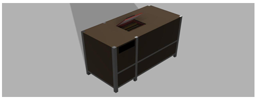
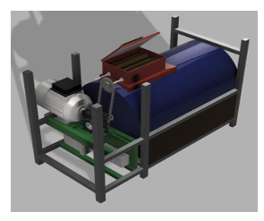
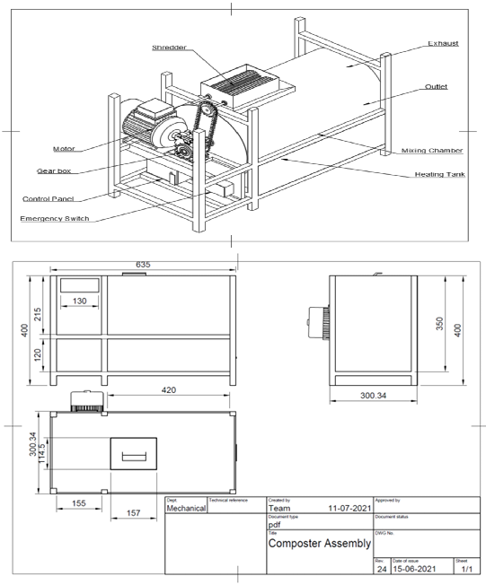
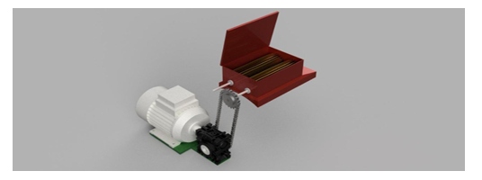
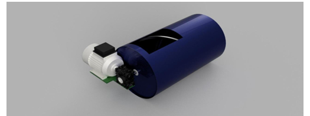
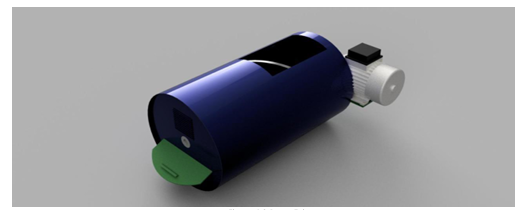
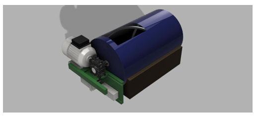
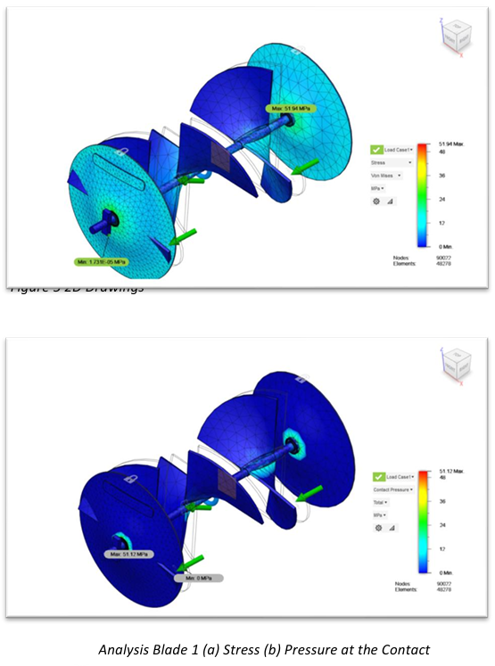
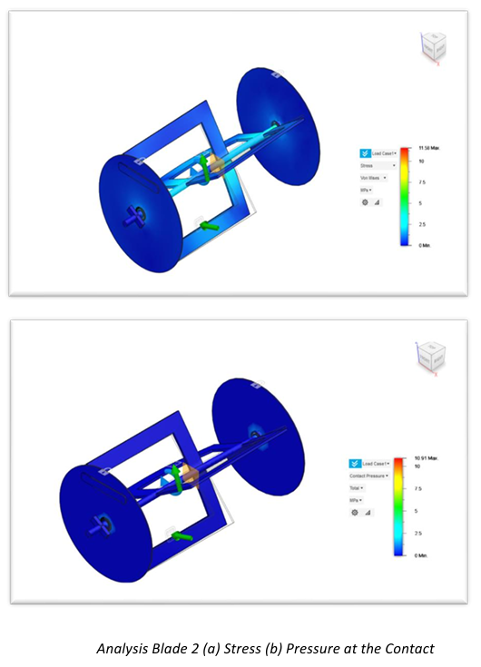
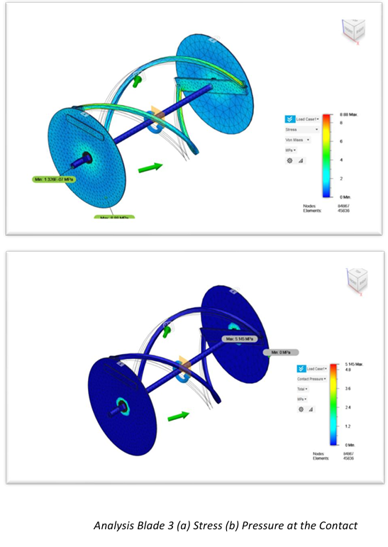

# Shredding-Cum-Composting Machine for Kitchen Waste

Mechanical engineering design and fabrication study of a **shredding-cum-composting machine for kitchen waste**, combining product development, mechanical calculations, CAD design, blade analysis, component selection, and cost estimation.

> **Project type:** University team project  
> **Discipline:** Mechanical Engineering  
> **Focus:** Product Development · Mechanical Design · Structural Analysis

---

## Project Overview

The project investigated a compact machine for processing kitchen waste through shredding, mixing, and controlled heating.

The documented engineering workflow included:

1. Customer-needs identification and survey
2. Quality Function Deployment (QFD)
3. Product Design Specification (PDS)
4. Mechanical calculations
5. Shredder and drum design
6. Motor and drive selection
7. CAD model development
8. Blade concept comparison and analysis
9. Component selection
10. Cost estimation

## Machine Design

The proposed system integrates a shredding mechanism, drive system, mixing drum, helical mixing blades, heating arrangement, structural frame, and enclosure.



### Internal Arrangement

The internal layout shows the mechanical arrangement of the drum, drive components, shredder region, and supporting frame.



### Engineering Drawing

The assembly drawing documents the overall machine configuration, principal dimensions, and major components.



---

## Mechanical Design Calculations

The project report documents the following design values:

| Parameter | Value |
|---|---:|
| Waste considered | 30 kg |
| Organic-waste density | 285 kg/m³ |
| Drum diameter | 270 mm |
| Calculated minimum shaft torque | 11 N·m |
| Calculated minimum shaft diameter | 9.7 mm |
| Selected shaft diameter | 15 mm |
| Calculated power requirement | 138.21 W |
| Calculated power | 0.19 HP |
| Selected motor | 0.25 HP |
| Motor speed | 1200 rpm |
| Gearbox reduction ratio | 1:10 |

The standard **15 mm shaft** was selected after the calculated minimum diameter of **9.7 mm**.

---

## Shredding and Drum System

The shredder uses a motor-driven transmission arrangement to reduce the kitchen waste before it enters the drum.



The drum provides the mixing chamber for the shredded material.



A helical-blade arrangement was intended to mix the material and move it toward the outlet.



---

## Heating Arrangement

The documented machine concept includes a heating tank, heating element, and thermostat-controlled arrangement.



---

## Blade Design and Structural Analysis

Three blade concepts were investigated and compared using the reported structural-analysis results.

| Alternative | Geometry | Max. stress | Max. displacement | Max. contact pressure |
|---|---|---:|---:|---:|
| 1 | Propeller-shaped | 51.94 MPa | 0.3213 mm | 51.12 MPa |
| 2 | Rectangular | 11.58 MPa | 0.08645 mm | 10.91 MPa |
| 3 | Helical | 8.88 MPa | 0.2045 mm | 5.145 MPa |

### Alternative 1 — Propeller-Shaped Blade



The report describes this configuration as having comparatively high stress and contact pressure.

### Alternative 2 — Rectangular Blade



The reported stress and contact pressure were lower than for Alternative 1, but uneven mixing was identified as a disadvantage.

### Alternative 3 — Helical Blade



The helical configuration produced the lowest reported maximum stress and contact pressure among the three investigated alternatives.

The report also describes the geometry as supporting even mixing and movement of material toward the exit. It was therefore the preferred concept in the documented design study.

---

## Cost Estimation

The documented project cost estimate was:

**₹17,592**

The estimate included:

- motor and shaft
- chain and sprocket gears
- drum
- heating element
- fan and thermostat
- structural frame
- sheet metal
- electronics/sensors
- miscellaneous items

---

## Repository Structure

```text
shredding-composting-machine-design/
├── README.md
├── images/
│   ├── README.md
│   ├── machine_assembly.png
│   ├── machine_internal_layout.png
│   ├── engineering_drawing.png
│   ├── shredder_mechanism.png
│   ├── drum_assembly.png
│   ├── drum_exit.png
│   ├── heating_tank_and_drum.png
│   ├── blade_1_fea.png
│   ├── blade_2_fea.png
│   └── blade_3_fea.png
├── results/
│   └── README.md
└── docs/
    └── README.md
```

## Engineering Skills Demonstrated

- Mechanical design
- Product development
- Engineering calculations
- Shaft and drive sizing
- Component selection
- CAD modelling
- Engineering drawings
- Structural-analysis interpretation
- Design-alternative comparison
- Design for fabrication
- Cost estimation
- QFD and Product Design Specification

---

## Project Scope and Attribution

This was a **four-person university team project**.

The available documentation identifies the project team but does not provide a reliable task-by-task breakdown of individual contributions.

**Individual contribution: Not confirmed from the uploaded files.**

Accordingly, this repository presents the engineering work as a team project rather than assigning individual ownership of specific calculations, CAD models, analyses, or fabrication activities.

The original academic report is not included because it contains student identification, signatures, certification material, and other academic administrative information.

The repository instead presents selected engineering figures and documented project results in a portfolio-oriented format.
